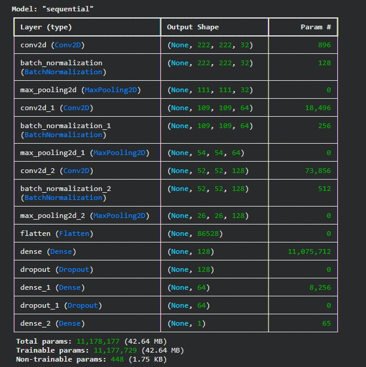
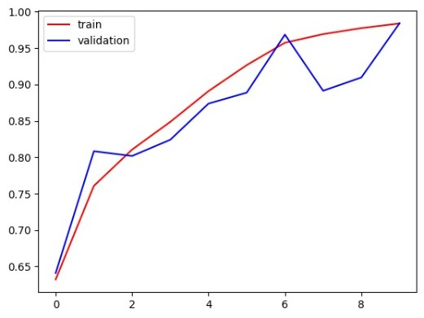
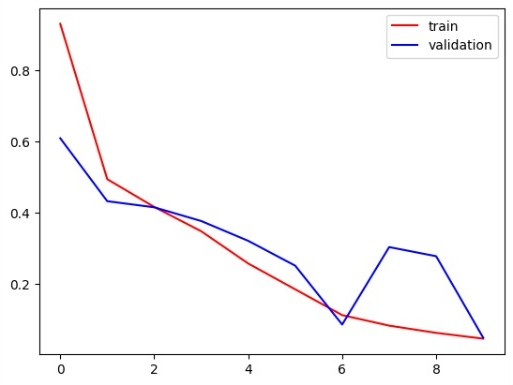

# 🐶🐱 Cat vs Dog Image Classification using CNN

This project implements a **Convolutional Neural Network (CNN)** using **TensorFlow and Keras** to classify images of **cats and dogs**.

The model learns visual features from images using convolutional layers and predicts whether the input image belongs to a **cat or a dog**.

---

# 📌 Project Overview

Image classification is one of the most important applications of **Deep Learning and Computer Vision**.

In this project:

* CNN model is built using **TensorFlow & Keras**
* Multiple **Conv2D layers** extract image features
* **Batch Normalization** stabilizes training
* **MaxPooling layers** reduce image size
* **Dropout layers** help prevent overfitting
* **Dense layers** perform final classification

---

# 🧠 Model Architecture

The CNN architecture contains several convolution blocks followed by fully connected layers.

## 📊 Model Summary

Below is the architecture summary of the CNN model.



### Model Details

| Component                | Value            |
| ------------------------ | ---------------- |
| Total Parameters         | 11,178,177       |
| Trainable Parameters     | 11,177,729       |
| Non-Trainable Parameters | 448              |
| Output Layer             | Dense (1 neuron) |
| Activation Function      | Sigmoid          |

---

# 📈 Training Accuracy vs Validation Accuracy

The following graph shows how **training accuracy and validation accuracy improve during training**.



### Observation

* Training accuracy increases steadily
* Validation accuracy follows closely
* Final accuracy reaches approximately **98%**

---

# 📉 Training Loss vs Validation Loss

The following graph shows the decrease in **training and validation loss**.



### Observation

* Training loss decreases continuously
* Validation loss also decreases
* Final loss becomes very small indicating good learning

---

# ⚙️ Technologies Used

| Technology | Purpose                 |
| ---------- | ----------------------- |
| Python     | Programming Language    |
| TensorFlow | Deep Learning Framework |
| Keras      | Neural Network API      |
| NumPy      | Numerical Computing     |
| Matplotlib | Data Visualization      |

---

# 📂 Repository Structure

```
Cat-vs-Dog-CNN
│
├── cat_vs_dog.ipynb
├── model_summary.jpeg
├── accuracy_graph.jpeg
├── loss_graph.jpeg
└── README.md
```

---

# 🧪 Model Training

Training configuration used:

| Parameter     | Value               |
| ------------- | ------------------- |
| Epochs        | 10                  |
| Optimizer     | Adam                |
| Loss Function | Binary Crossentropy |
| Batch Size    | 32                  |

---

# 📊 Visualization Code

```python
import matplotlib.pyplot as plt

plt.plot(history.history["accuracy"], color="red", label="train")
plt.plot(history.history["val_accuracy"], color="blue", label="validation")
plt.legend()
plt.show()

plt.plot(history.history["loss"], color="red", label="train")
plt.plot(history.history["val_loss"], color="blue", label="validation")
plt.legend()
plt.show()
```

---

# 🚀 How to Run the Project

### Clone the repository

```
git clone https://github.com/yourusername/cat-vs-dog-cnn.git
```

### Install dependencies

```
pip install tensorflow numpy matplotlib
```

### Run Jupyter Notebook

```
jupyter notebook
```

Open **cat_vs_dog.ipynb** and run all cells.

---

# 🎯 Results

| Metric              | Value |
| ------------------- | ----- |
| Training Accuracy   | ~98%  |
| Validation Accuracy | ~98%  |
| Training Loss       | ~0.05 |
| Validation Loss     | ~0.05 |

The CNN model successfully learns meaningful visual features and performs accurate classification.

---

# 👨‍💻 Author

**Vishal Kumar**

B-Tech in Artificial Intelligence and Data Science
